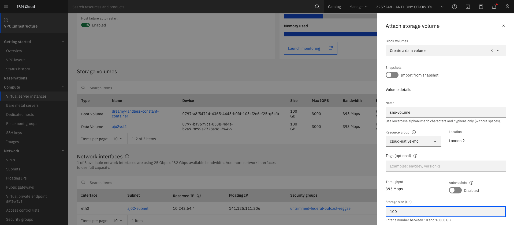

# :closed_book: External storage for Single Node OpenShift

External storage is only necessary if you are using Single Node OpenShift. You
can skip this entire topic if you are using IBM ROKS or similar.

---

## Add external storage

In this section, we show you how to add an external disk on IBM Cloud. The
process is similar for other cloud providers.

In your IBM Cloud account locate the virtual server that is running your SNO
cluster.



<br>

In the `Storage volumes` section, select **`Attach  +` to bring up the storage
dialog:

Add an external disk with the following properties:
- `Block Volumes`: **Create a data volume**
- `Name`: **sno-volume**
- `Resource group`: **cloud-native-mq**
- `Storage size (GB)`: **100**

The storage will take a few moments to be allocated to the virtual server. Once
it's created, you will see it alongside the `Boot volume` that is used for the
cluster storage.

---

## Add storage to virtual machine

The SNO cluster is running in a virtual machine inside the virtual server. We
now attach the recently created storage attached to the virtual server to the
this virtual machine. To do this, we log into the virtual machine, and update
the VM configuration.

```bash
ssh root@<sno-vm-ip-address>
```

```bash
lsblk
```

```bash
NAME                MAJ:MIN RM   SIZE RO TYPE MOUNTPOINT
vda                 252:0    0   100G  0 disk
├─vda1              252:1    0     1G  0 part /boot
├─vda2              252:2    0   100M  0 part /boot/efi
└─vda3              252:3    0  98.9G  0 part
  ├─vg_virt-lv_root 253:0    0  97.9G  0 lvm  /
  └─vg_virt-lv_swap 253:1    0     1G  0 lvm
vdb                 252:16   0 558.8G  0 disk
└─vdb1              252:17   0 558.8G  0 part
  └─vg_kvm-lv_kvm   253:2    0 558.8G  0 lvm  /mnt/kvmimgs
vdc                 252:32   0   368K  0 disk
vdd                 252:48   0    44K  0 disk
vde                 252:64   0   100G  0 disk
```

```bash
fdisk /dev/vde
```

You will be presented with a dialog; select in order the following options:
- `Command`: **n** (to specify a new partition)
- `Partition type`: **p**
- `Partition number`: (default)
- `First sector` (default)
- `Last sector`: (default)
- `Command`: **p** (to create the partition)
- `Command`: **w** (to update and exit)

Here's the sample output for a 100GB disk:

```bash
Welcome to fdisk (util-linux 2.32.1).
Changes will remain in memory only, until you decide to write them.
Be careful before using the write command.

Device does not contain a recognized partition table.
Created a new DOS disklabel with disk identifier 0x087dcab8.

Command (m for help): n
Partition type
   p   primary (0 primary, 0 extended, 4 free)
   e   extended (container for logical partitions)
Select (default p): p
Partition number (1-4, default 1):
First sector (2048-209715199, default 2048):
Last sector, +sectors or +size{K,M,G,T,P} (2048-209715199, default 209715199):

Created a new partition 1 of type 'Linux' and of size 100 GiB.

Command (m for help): w
The partition table has been altered.
Calling ioctl() to re-read partition table.
Syncing disks.
```

We now 

```bash
virsh list
```

```bash
Id   Name             State
--------------------------------
 2    sno_utility_vm   running
 3    ajoclus02-vm     running
```

```bash
virsh shutdown sno-vm
```

```bash
Domain 'ajoclus02-vm' is being shutdown
```

```bash
virsh edit sno-vm
```

```xml
<disk type='block' device='disk'>
      <driver name='qemu' type='raw'/>
      <source dev='/dev/vde'/>
      <target dev='vdb' bus='virtio'/>
</disk>
```

```bash
lsblk
```

```bash
NAME                MAJ:MIN RM   SIZE RO TYPE MOUNTPOINT
...
vde                 252:64   0   100G  0 disk
└─vde1              252:65   0   100G  0 par
```

```bash
virsh start sno-vm
```

---

## Install LVM operator for storage

A queue manager stores its persistent messages and transactions in its queue
files and log files respectively. This file system provides a recoverable store
such that when the queue manager restarts, it uses theses files to establish its
point of recovery when it was last stopped, either normally or in a failure
scenario. We'd like this file storage to not be tied to a specific pod, so-called
**ephemeral storage**. Hence we'd like to configure our queue manager to use
storage external to the cluster.

We do this by configuring a storage class; it identifies the provisioner that
will create the persistent volumes and persistent volume claims that map to our
external storage. In this tutorial, we use
[LVM](https://access.redhat.com/documentation/en-us/red_hat_enterprise_linux/5/html/deployment_guide/ch-lvm)
as a provisioner because it is lightweight and quick to get going. Since all
Kubernetes storage provisioners conform to the same interface --
[CSI](https://access.redhat.com/documentation/en-us/openshift_container_platform/4.4/html/storage/using-container-storage-interface-csi)
-- once you've used one, it's easy to use another one. For example AWS, Azure
and Google all provide CSIs to access their native storage types.

We need to define an **Operator Group** for LVM which identifies the
`openshift-storage` namespace in which to it generates required RBAC access for
the LVM.

Issue the following command to create the operator group:

```bash
oc apply -f setup/lvm-operatorgroup.yaml
```
which will create the operator group:

```bash
operatorgroup.operators.coreos.com/openshift-storage-operatorgroup created
```

Now we can issue the following command to install the LVM operator:

```bash
oc apply -f setup/lvm-operator-sub.yaml
```
which will create a subscription:

```bash
subscription.operators.coreos.com/lvm-operator created
```

Again, this subscription enables the cluster to keep up-to-date with new version
of LVM.

Explore the subscription using the following command:

```bash
cat setup/lvm-operator-sub.yaml
```

which details the subscription:

```yaml
apiVersion: operators.coreos.com/v1alpha1
kind: Subscription
metadata:
  name: lvms-operator
  namespace: openshift-storage
spec:
  channel: stable-4.12
  installPlanApproval: Automatic
  name: lvms-operator
  source: redhat-operators
  sourceNamespace: openshift-marketplace
```

In a full production system, we might prefer to use `Manual` rather than
`Automatic`; our choice allows us to get going a little quicker.

---

## Verify LVM operator

Again, feel free to verify the LVM Tekton installation with the following command:

```bash
oc get clusterserviceversion -n openshift-storage
```

to see the full set of operators we've installed.

```bash
NAME                                     DISPLAY                                       VERSION   REPLACES                              PHASE
ibm-common-service-operator.v3.23.9      IBM Cloud Pak foundational services           3.23.9    ibm-common-service-operator.v3.23.8   Succeeded
ibm-mq.v2.4.4                            IBM MQ                                        2.4.4     ibm-mq.v2.4.3                         Succeeded
lvms-operator.v4.12.1                    LVM Storage                                   4.12.1    lvms-operator.v4.12.0                 Succeeded
openshift-cert-manager.v1.7.1            cert-manager Operator for Red Hat OpenShift   1.7.1-1                                         Succeeded
openshift-gitops-operator.v1.5.10        Red Hat OpenShift GitOps                      1.5.10    openshift-gitops-operator.v1.5.9      Succeeded
openshift-pipelines-operator-rh.v1.9.3   Red Hat OpenShift Pipelines                   1.9.3                                           Succeeded
```

This output shows the version of the LVM operator that has been successfully installed.

Use the following command to learn more about the LVM operator.

```bash
oc describe csv lvms-operator-v4.12.0 -n openshift-storage
```

---

## Creating an LVM instance

Now we've installed the LVM operator, we can create an instance of an LVM
cluster to manage our external storage -- to make it available through a storage
class.

Issue the following command:

```bash
oc apply -f setup/lvm-cluster.yaml
```

which will create an LVM cluster instance:

```bash
lvmcluster.lvm.topolvm.io/mq-lvmcluster created
```

In about 30 seconds the cluster will have started.

Issue the following command:

```bash
oc get pod -n openshift-storage
```

It will show the pods responsible for LVM are now up and running:

```bash
NAME                                  READY   STATUS    RESTARTS       AGE
lvms-operator-f5559ddc-hl5lv          3/3     Running   4 (6d1h ago)   6d4h
topolvm-controller-5496f5d4f4-2kwhk   5/5     Running   5 (6d1h ago)   6d4h
topolvm-node-pkl2w                    4/4     Running   0              6d4h
vg-manager-wtp6s                      1/1     Running   0              6d4h
```

You can also see the storage class is available.

Issue the following command:

```bash
oc get storageclass
```

which will show the storage class properties:

```bash
NAME                 PROVISIONER   RECLAIMPOLICY   VOLUMEBINDINGMODE      ALLOWVOLUMEEXPANSION   AGE
lvms-vg1 (default)   topolvm.io    Delete          WaitForFirstConsumer   true
```

We will reference the `lvms-vg1` storage class in our queue manager to claim
some file system storage on the external storage device for the queue files and
log files for `mq01`.

